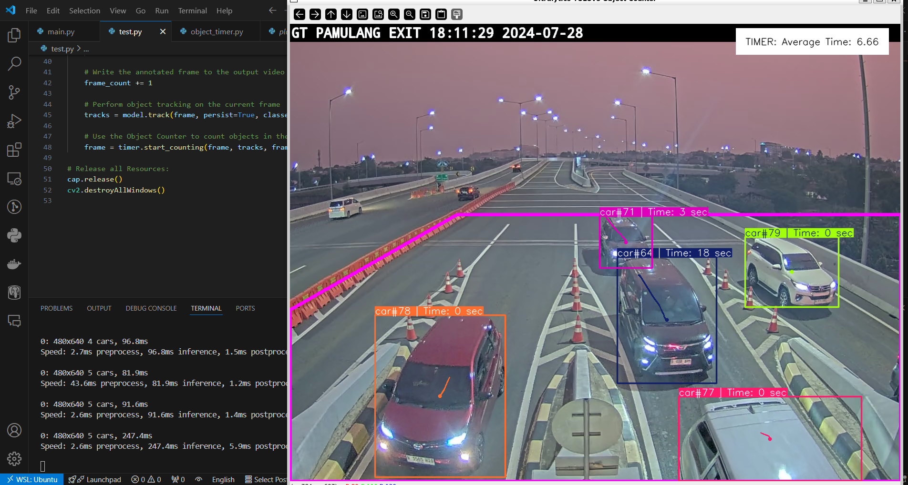

# YOLO Object Timing

This repository provides code to calculate the duration that objects remain within a defined region using YOLO. Based on the object counting code from Ultralytics, this project extends the functionality to include timing calculations.

## Overview

YOLO Object Timing leverages the power of YOLO (You Only Look Once) for object detection and tracking. It adds a timing component to measure how long each detected object stays within a specified region in the video frame.

## Features

- **Object Detection**: Detects objects using the YOLOv8 model.
- **Region of Interest**: Defines a specific region in the video frame to monitor.
- **Object Timing Per Individual Object**: Tracks and calculates the time for each individual object.
- **Average Timing from All Objects**: Computes the average time all objects spend in the defined region.
- **Object Timing for Specific Object Using Tracking**: Tracks and calculates the time for specific objects based on tracking ID.
- **Real-time Processing**: Processes video streams in real-time.

## How It Works

1. **Initialization**: The YOLO model is initialized and video input is set up.
2. **Region Definition**: A region of interest (ROI) is defined within the video frame.
3. **Object Tracking**: Objects are detected and tracked using YOLO.
4. **Timing Calculation**: For each detected object, the time spent within the ROI is calculated and displayed.

## Installation

Clone the repository and install the required libraries:

```bash
git clone https://github.com/zanjabil2502/Yolo-Object-Timing.git
cd Yolo-Object-Timing
pip install -r requirements.txt
```

## Usage

1. Define Your Region: Specify the coordinates of the region in the script.
2. Run the Script: Execute the script to start processing the video and timing objects.

```python
import cv2
from ultralytics import YOLO
from src.object_timer import ObjectTimer

path_model = "yolov8n.pt" # You can change model
url = "Your source path" # You can use Video or Path CCTV Realtime

# Initialize YOLOv8 Detection Model
model = YOLO(path_model)
classes_to_count = [2]  # car classes for count
region_points = [(0, 600), (350, 400), (1280, 400), (1280, 960), (0, 960)]

# Open the Video File
cap = cv2.VideoCapture(url)
assert cap.isOpened(), "Error reading video file"
fps = cap.get(cv2.CAP_PROP_FPS)


# Initialize Object Counter
timer = ObjectTimer(
    fps=fps,  # FPS from you source video
    view_img=True,  # Display the image during processing
    reg_pts=region_points,  # Region of interest points
    names=model.names,  # Class names from the YOLO model
    draw_tracks=True,  # Draw tracking lines for objects
    line_thickness=2,  # Thickness of the lines drawn
)


# itterate over video frames:
frame_count = 0
while cap.isOpened():
    success, frame = cap.read()
    if not success:
        print(
            "Video frame is empty or video processing has been successfully completed."
        )
        break

    # Write the annotated frame to the output video
    frame_count += 1

    # Perform object tracking on the current frame
    tracks = model.track(frame, persist=True, classes=classes_to_count)

    # Use the Object Counter to count objects in the frame and get the annotated image
    frame = timer.start_timing(frame, tracks, frame_count)

# Release all Resources:
cap.release()
cv2.destroyAllWindows()
```

## Example Images



## Use Case Analysis

### 1. Analysis of Waiting Time or Queue at Toll Gates, Traffic Lights, and Cashiers

This system can be employed to analyze the waiting times at various points of interest:

- **Toll Gates**: Measure how long vehicles stay in the toll gate area, providing insights into congestion and processing efficiency.
- **Traffic Lights**: Calculate the duration vehicles or pedestrians wait at traffic lights, helping optimize traffic flow and signal timings.
- **Cashiers**: Track the time customers spend waiting at cashier lines in retail stores, aiding in staff allocation and queue management.

### 2. Analysis of Customer Visit Duration at Cafes or Restaurants

Monitor and analyze how long customers stay in designated areas within cafes or restaurants:

- **Customer Behavior**: Understand customer behavior and average visit durations to improve service and customer experience.
- **Table Turnover**: Measure the turnover rate of tables to optimize seating arrangements and service efficiency.


## Contributing
Contributions are welcome! Please fork the repository and submit a pull request for any enhancements or bug fixes.